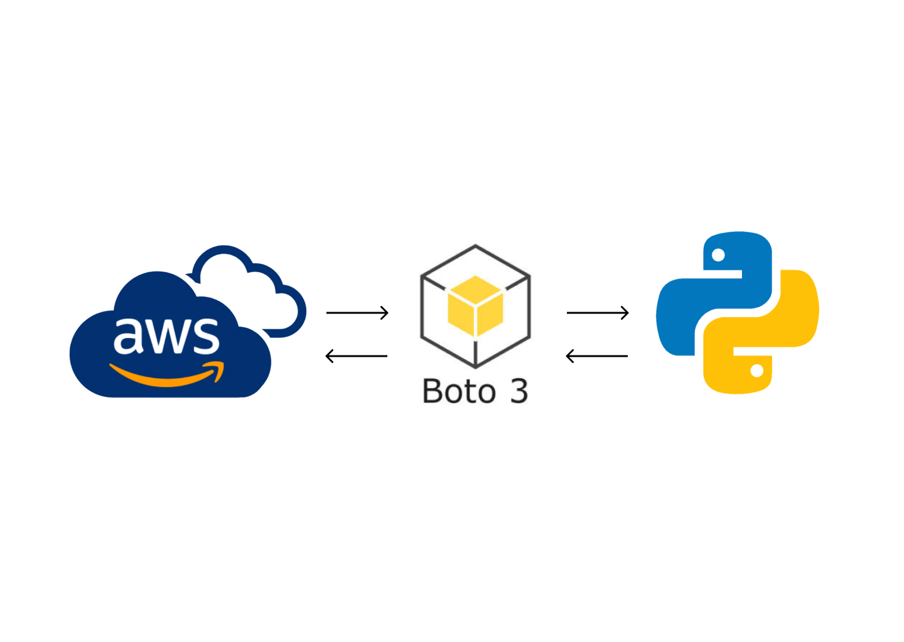

# A Beginner’s Guide to Data Engineering: Harnessing the Power of Python to Access AWS Services

- This repo illustrates how you can access AWS services programmatically using Python.
- This repo contains code for the blog [A Beginner’s Guide to Data Engineering: Harnessing the Power of Python to Access AWS Services]()
- Here I have provided a detailed step-by-step guide to easily setup boto3 SDK and use this SDK to programatically access AWS services using Python

## Written By:
- **Anish Shilpakar**
- Email: _anishshilpakar8@gmail.com_
- Blog: [_**AN!SH_WR!TES**_](https://anish-shilpakar.com.np/)

## Files Description
1. aws_python.ipynb => This notebook contains detailed step-by-step guide to easily setup and use boto3 to access AWS services
2. credentials.cfg.example => This is an example file for credentials.cfg where you will store your secret credentials
3. test_data.csv => This is the test data uploaded to s3 bucket
4. requirements.txt => Some requirements for running code